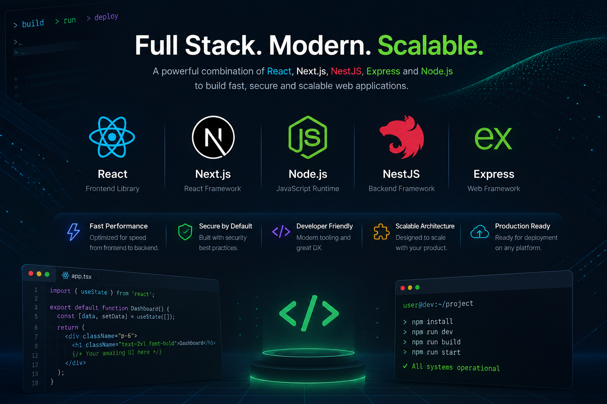

# Aghaaz

> Scaffold production-ready React, Next.js, NestJS, and full-stack applications in seconds.

<p align="center">
  
</p>

Aghaaz is an opinionated project scaffolding CLI that bootstraps modern JavaScript and TypeScript applications with production-grade architecture.

Instead of spending hours configuring frameworks, folder structures, styling, HTTP clients, state management, linting, testing, and other boilerplate, Aghaaz generates a clean, scalable foundation so you can start building features immediately.

---

## ✨ Features

- 🚀 Scaffold projects in seconds
- 📦 Support for modern frontend and backend frameworks
- 🏗️ Production-ready folder architecture
- ⚙️ Interactive CLI experience
- 🧩 Choose your preferred libraries during setup
- 📈 Built for scalability and maintainability
- 🔧 Extensible architecture for future templates

---

# Supported Stacks

```
Frontend
├── Next.js
└── React (Coming Soon)

Backend
├── NestJS (Coming Soon)
└── Express (Coming Soon)

Full Stack
├── Next.js + NestJS
└── React + NestJS
```

---

# Quick Start

## Prerequisites

- Node.js 20+

## Install

```bash
npm install -g aghaaz
```

or

```bash
pnpm add -g aghaaz
```

## Create a project

```bash
aghaaz create
```

Follow the interactive prompts to configure your project.

---

# Roadmap

Planned support includes:

- Tailwind CSS
- Mantine UI
- Material UI
- Axios
- Ky
- TanStack Query
- Authentication templates
- Docker
- CI/CD
- Testing setup
- ESLint & Formatting
- Production deployment templates

---

# Contributing

Contributions are welcome.

1. Fork the repository
2. Create a feature branch

```bash
git checkout -b feature/my-feature
```

3. Commit your changes

```bash
git commit -m "feat: add awesome feature"
```

4. Push your branch

```bash
git push origin feature/my-feature
```

5. Open a Pull Request

---

# License

MIT © [Zaryab](https://www.zaryabit.com)
